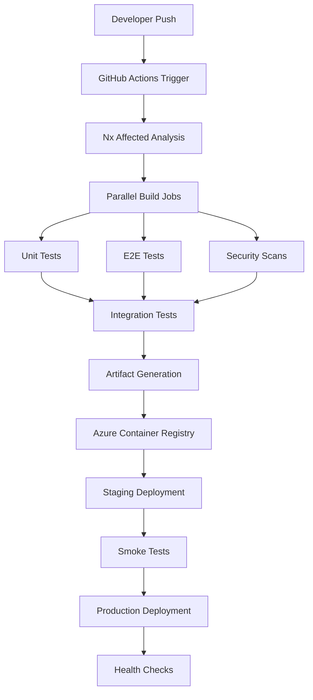

# BuildAQ CI/CD Pipeline Setup

## Overview
This document outlines the CI/CD pipeline architecture for the BuildAQ multi-domain micro-frontend platform using GitHub Actions, Azure DevOps, and automated deployment strategies.

## Pipeline Architecture



## 1. GitHub Actions Workflows

### 1.1 Main CI/CD Workflow

```yaml
# .github/workflows/ci-cd.yml
name: CI/CD Pipeline

on:
  push:
    branches: [ main, develop ]
  pull_request:
    branches: [ main ]

env:
  AZURE_CONTAINER_REGISTRY: buildaq.azurecr.io
  AZURE_RESOURCE_GROUP: buildaq-rg
  AZURE_AKS_CLUSTER: buildaq-aks

jobs:
  setup:
    runs-on: ubuntu-latest
    outputs:
      affected-projects: ${{ steps.affected.outputs.projects }}
      affected-e2e: ${{ steps.affected.outputs.e2e }}
    steps:
      - uses: actions/checkout@v4
        with:
          fetch-depth: 0
      
      - name: Setup Node.js
        uses: actions/setup-node@v4
        with:
          node-version: '20'
          cache: 'npm'
      
      - name: Install dependencies
        run: npm ci
      
      - name: Derive appropriate SHAs for base and head
        uses: nrwl/nx-set-shas@v4
      
      - name: Get affected projects
        id: affected
        run: |
          echo "projects=$(npx nx show projects --affected --json)" >> $GITHUB_OUTPUT
          echo "e2e=$(npx nx show projects --affected --type=e2e --json)" >> $GITHUB_OUTPUT

  lint-and-test:
    runs-on: ubuntu-latest
    needs: setup
    if: ${{ needs.setup.outputs.affected-projects != '[]' }}
    strategy:
      matrix:
        project: ${{ fromJson(needs.setup.outputs.affected-projects) }}
    steps:
      - uses: actions/checkout@v4
        with:
          fetch-depth: 0
      
      - name: Setup Node.js
        uses: actions/setup-node@v4
        with:
          node-version: '20'
          cache: 'npm'
      
      - name: Install dependencies
        run: npm ci
      
      - name: Lint ${{ matrix.project }}
        run: npx nx lint ${{ matrix.project }}
      
      - name: Test ${{ matrix.project }}
        run: npx nx test ${{ matrix.project }} --coverage
      
      - name: Upload coverage reports
        uses: codecov/codecov-action@v3
        with:
          file: ./coverage/${{ matrix.project }}/lcov.info
          flags: ${{ matrix.project }}

  build:
    runs-on: ubuntu-latest
    needs: [setup, lint-and-test]
    if: ${{ needs.setup.outputs.affected-projects != '[]' }}
    strategy:
      matrix:
        project: ${{ fromJson(needs.setup.outputs.affected-projects) }}
    steps:
      - uses: actions/checkout@v4
        with:
          fetch-depth: 0
      
      - name: Setup Node.js
        uses: actions/setup-node@v4
        with:
          node-version: '20'
          cache: 'npm'
      
      - name: Install dependencies
        run: npm ci
      
      - name: Build ${{ matrix.project }}
        run: npx nx build ${{ matrix.project }} --configuration=production
      
      - name: Upload build artifacts
        uses: actions/upload-artifact@v4
        with:
          name: ${{ matrix.project }}-build
          path: dist/${{ matrix.project }}

  e2e-tests:
    runs-on: ubuntu-latest
    needs: [setup, build]
    if: ${{ needs.setup.outputs.affected-e2e != '[]' }}
    strategy:
      matrix:
        e2e: ${{ fromJson(needs.setup.outputs.affected-e2e) }}
    steps:
      - uses: actions/checkout@v4
        with:
          fetch-depth: 0
      
      - name: Setup Node.js
        uses: actions/setup-node@v4
        with:
          node-version: '20'
          cache: 'npm'
      
      - name: Install dependencies
        run: npm ci
      
      - name: Download build artifacts
        uses: actions/download-artifact@v4
      
      - name: Run E2E tests
        run: npx nx e2e ${{ matrix.e2e }}

  security-scan:
    runs-on: ubuntu-latest
    needs: setup
    steps:
      - uses: actions/checkout@v4
      
      - name: Run Snyk to check for vulnerabilities
        uses: snyk/actions/node@master
        env:
          SNYK_TOKEN: ${{ secrets.SNYK_TOKEN }}
        with:
          args: --severity-threshold=high
      
      - name: Run CodeQL Analysis
        uses: github/codeql-action/analyze@v3
        with:
          languages: javascript

  docker-build:
    runs-on: ubuntu-latest
    needs: [build, e2e-tests]
    if: github.ref == 'refs/heads/main'
    strategy:
      matrix:
        app: ['schools', 'hospital', 'retail', 'finance', 'logistics', 'hrms', 'crm', 'shell']
    steps:
      - uses: actions/checkout@v4
      
      - name: Download build artifacts
        uses: actions/download-artifact@v4
        with:
          name: ${{ matrix.app }}-build
          path: dist/${{ matrix.app }}
      
      - name: Azure Container Registry Login
        uses: azure/docker-login@v1
        with:
          login-server: ${{ env.AZURE_CONTAINER_REGISTRY }}
          username: ${{ secrets.AZURE_ACR_USERNAME }}
          password: ${{ secrets.AZURE_ACR_PASSWORD }}
      
      - name: Build and push Docker image
        run: |
          docker build -f docker/${{ matrix.app }}/Dockerfile -t ${{ env.AZURE_CONTAINER_REGISTRY }}/${{ matrix.app }}:${{ github.sha }} .
          docker tag ${{ env.AZURE_CONTAINER_REGISTRY }}/${{ matrix.app }}:${{ github.sha }} ${{ env.AZURE_CONTAINER_REGISTRY }}/${{ matrix.app }}:latest
          docker push ${{ env.AZURE_CONTAINER_REGISTRY }}/${{ matrix.app }}:${{ github.sha }}
          docker push ${{ env.AZURE_CONTAINER_REGISTRY }}/${{ matrix.app }}:latest

  deploy-staging:
    runs-on: ubuntu-latest
    needs: docker-build
    if: github.ref == 'refs/heads/main'
    environment: staging
    steps:
      - uses: actions/checkout@v4
      
      - name: Azure Login
        uses: azure/login@v1
        with:
          creds: ${{ secrets.AZURE_CREDENTIALS }}
      
      - name: Get AKS credentials
        run: |
          az aks get-credentials --resource-group ${{ env.AZURE_RESOURCE_GROUP }} --name ${{ env.AZURE_AKS_CLUSTER }}
      
      - name: Deploy to staging
        run: |
          envsubst < k8s/staging/deployment.yaml | kubectl apply -f -
          kubectl rollout status deployment/buildaq-platform -n staging
        env:
          IMAGE_TAG: ${{ github.sha }}

  smoke-tests:
    runs-on: ubuntu-latest
    needs: deploy-staging
    steps:
      - uses: actions/checkout@v4
      
      - name: Run smoke tests
        run: |
          npm ci
          npx playwright test --config=playwright.staging.config.ts

  deploy-production:
    runs-on: ubuntu-latest
    needs: smoke-tests
    if: github.ref == 'refs/heads/main'
    environment: production
    steps:
      - uses: actions/checkout@v4
      
      - name: Azure Login
        uses: azure/login@v1
        with:
          creds: ${{ secrets.AZURE_CREDENTIALS }}
      
      - name: Get AKS credentials
        run: |
          az aks get-credentials --resource-group ${{ env.AZURE_RESOURCE_GROUP }} --name ${{ env.AZURE_AKS_CLUSTER }}
      
      - name: Deploy to production
        run: |
          envsubst < k8s/production/deployment.yaml | kubectl apply -f -
          kubectl rollout status deployment/buildaq-platform -n production
        env:
          IMAGE_TAG: ${{ github.sha }}
      
      - name: Run health checks
        run: |
          kubectl wait --for=condition=ready pod -l app=buildaq-platform -n production --timeout=300s
```

### 1.2 Backend Services CI/CD

```yaml
# .github/workflows/backend-ci-cd.yml
name: Backend Services CI/CD

on:
  push:
    branches: [ main, develop ]
    paths: 
      - 'backend/**'
      - '.github/workflows/backend-ci-cd.yml'

env:
  DOTNET_VERSION: '8.0'
  AZURE_CONTAINER_REGISTRY: buildaq.azurecr.io

jobs:
  backend-test:
    runs-on: ubuntu-latest
    strategy:
      matrix:
        service: ['Auth', 'Schools', 'Hospital', 'Retail', 'Finance', 'Logistics', 'HRMS', 'CRM']
    steps:
      - uses: actions/checkout@v4
      
      - name: Setup .NET
        uses: actions/setup-dotnet@v4
        with:
          dotnet-version: ${{ env.DOTNET_VERSION }}
      
      - name: Restore dependencies
        run: dotnet restore backend/src/BuildAQ.${{ matrix.service }}.API
      
      - name: Build
        run: dotnet build backend/src/BuildAQ.${{ matrix.service }}.API --no-restore
      
      - name: Test
        run: dotnet test backend/tests/BuildAQ.${{ matrix.service }}.Tests --no-build --verbosity normal --collect:"XPlat Code Coverage"
      
      - name: Upload coverage reports
        uses: codecov/codecov-action@v3
        with:
          file: ./TestResults/*/coverage.cobertura.xml
          flags: ${{ matrix.service }}

  backend-build:
    runs-on: ubuntu-latest
    needs: backend-test
    if: github.ref == 'refs/heads/main'
    strategy:
      matrix:
        service: ['Auth', 'Schools', 'Hospital', 'Retail', 'Finance', 'Logistics', 'HRMS', 'CRM']
    steps:
      - uses: actions/checkout@v4
      
      - name: Azure Container Registry Login
        uses: azure/docker-login@v1
        with:
          login-server: ${{ env.AZURE_CONTAINER_REGISTRY }}
          username: ${{ secrets.AZURE_ACR_USERNAME }}
          password: ${{ secrets.AZURE_ACR_PASSWORD }}
      
      - name: Build and push Docker image
        run: |
          docker build -f backend/src/BuildAQ.${{ matrix.service }}.API/Dockerfile -t ${{ env.AZURE_CONTAINER_REGISTRY }}/buildaqapi-${{ matrix.service | lower }}:${{ github.sha }} backend/
          docker tag ${{ env.AZURE_CONTAINER_REGISTRY }}/buildaqapi-${{ matrix.service | lower }}:${{ github.sha }} ${{ env.AZURE_CONTAINER_REGISTRY }}/buildaqapi-${{ matrix.service | lower }}:latest
          docker push ${{ env.AZURE_CONTAINER_REGISTRY }}/buildaqapi-${{ matrix.service | lower }}:${{ github.sha }}
          docker push ${{ env.AZURE_CONTAINER_REGISTRY }}/buildaqapi-${{ matrix.service | lower }}:latest
```

### 1.3 Infrastructure as Code

```yaml
# .github/workflows/infrastructure.yml
name: Infrastructure Deployment

on:
  push:
    branches: [ main ]
    paths:
      - 'infrastructure/**'
      - '.github/workflows/infrastructure.yml'

jobs:
  terraform-plan:
    runs-on: ubuntu-latest
    steps:
      - uses: actions/checkout@v4
      
      - name: Setup Terraform
        uses: hashicorp/setup-terraform@v3
        with:
          terraform_version: 1.6.0
      
      - name: Azure Login
        uses: azure/login@v1
        with:
          creds: ${{ secrets.AZURE_CREDENTIALS }}
      
      - name: Terraform Init
        run: |
          cd infrastructure/terraform
          terraform init
      
      - name: Terraform Plan
        run: |
          cd infrastructure/terraform
          terraform plan -out=tfplan
      
      - name: Upload Terraform Plan
        uses: actions/upload-artifact@v4
        with:
          name: terraform-plan
          path: infrastructure/terraform/tfplan

  terraform-apply:
    runs-on: ubuntu-latest
    needs: terraform-plan
    if: github.ref == 'refs/heads/main'
    environment: infrastructure
    steps:
      - uses: actions/checkout@v4
      
      - name: Setup Terraform
        uses: hashicorp/setup-terraform@v3
        with:
          terraform_version: 1.6.0
      
      - name: Azure Login
        uses: azure/login@v1
        with:
          creds: ${{ secrets.AZURE_CREDENTIALS }}
      
      - name: Download Terraform Plan
        uses: actions/download-artifact@v4
        with:
          name: terraform-plan
          path: infrastructure/terraform
      
      - name: Terraform Init
        run: |
          cd infrastructure/terraform
          terraform init
      
      - name: Terraform Apply
        run: |
          cd infrastructure/terraform
          terraform apply tfplan
```

## 2. Domain-Specific Deployment Strategies

### 2.1 Schools Domain Pipeline

```yaml
# .github/workflows/schools-deployment.yml
name: Schools Domain Deployment

on:
  push:
    branches: [ main ]
    paths:
      - 'apps/schools/**'
      - 'libs/schools/**'

jobs:
  deploy-schools:
    runs-on: ubuntu-latest
    steps:
      - uses: actions/checkout@v4
      
      - name: Deploy to schools.buildaq.com
        run: |
          # Build schools micro-frontend
          npx nx build schools --configuration=production
          
          # Deploy to Azure Static Web Apps
          npx swa deploy ./dist/schools --deployment-token ${{ secrets.SCHOOLS_DEPLOYMENT_TOKEN }}
      
      - name: Update DNS
        run: |
          # Update CNAME record for schools.buildaq.com
          az network dns record-set cname set-record \
            --resource-group buildaq-dns-rg \
            --zone-name buildaq.com \
            --record-set-name schools \
            --cname schools.buildaq.com
```

### 2.2 Hospital Domain Pipeline

```yaml
# .github/workflows/hospital-deployment.yml
name: Hospital Domain Deployment

on:
  push:
    branches: [ main ]
    paths:
      - 'apps/hospital/**'
      - 'libs/hospital/**'

jobs:
  deploy-hospital:
    runs-on: ubuntu-latest
    steps:
      - uses: actions/checkout@v4
      
      - name: Deploy to hospital.buildaq.com
        run: |
          npx nx build hospital --configuration=production
          npx swa deploy ./dist/hospital --deployment-token ${{ secrets.HOSPITAL_DEPLOYMENT_TOKEN }}
```

## 3. Kubernetes Deployment Configuration

### 3.1 Staging Environment

```yaml
# k8s/staging/deployment.yaml
apiVersion: apps/v1
kind: Deployment
metadata:
  name: buildaq-platform
  namespace: staging
spec:
  replicas: 2
  selector:
    matchLabels:
      app: buildaq-platform
  template:
    metadata:
      labels:
        app: buildaq-platform
    spec:
      containers:
      - name: shell
        image: ${AZURE_CONTAINER_REGISTRY}/shell:${IMAGE_TAG}
        ports:
        - containerPort: 80
        env:
        - name: ENVIRONMENT
          value: "staging"
      - name: schools
        image: ${AZURE_CONTAINER_REGISTRY}/schools:${IMAGE_TAG}
        ports:
        - containerPort: 80
      - name: hospital
        image: ${AZURE_CONTAINER_REGISTRY}/hospital:${IMAGE_TAG}
        ports:
        - containerPort: 80
---
apiVersion: v1
kind: Service
metadata:
  name: buildaq-platform-service
  namespace: staging
spec:
  selector:
    app: buildaq-platform
  ports:
  - protocol: TCP
    port: 80
    targetPort: 80
  type: ClusterIP
---
apiVersion: networking.k8s.io/v1
kind: Ingress
metadata:
  name: buildaq-platform-ingress
  namespace: staging
  annotations:
    nginx.ingress.kubernetes.io/rewrite-target: /
    cert-manager.io/cluster-issuer: letsencrypt-staging
spec:
  tls:
  - hosts:
    - staging.buildaq.com
    - schools-staging.buildaq.com
    - hospital-staging.buildaq.com
    secretName: buildaq-staging-tls
  rules:
  - host: staging.buildaq.com
    http:
      paths:
      - path: /
        pathType: Prefix
        backend:
          service:
            name: buildaq-platform-service
            port:
              number: 80
```

## 4. Environment Configuration

### 4.1 GitHub Secrets Setup

Required secrets in GitHub repository settings:

```bash
# Azure Credentials
AZURE_CREDENTIALS='{
  "clientId": "xxx",
  "clientSecret": "xxx", 
  "subscriptionId": "xxx",
  "tenantId": "xxx"
}'

# Container Registry
AZURE_ACR_USERNAME=buildaq
AZURE_ACR_PASSWORD=xxx

# Deployment Tokens
SCHOOLS_DEPLOYMENT_TOKEN=xxx
HOSPITAL_DEPLOYMENT_TOKEN=xxx
RETAIL_DEPLOYMENT_TOKEN=xxx
FINANCE_DEPLOYMENT_TOKEN=xxx
LOGISTICS_DEPLOYMENT_TOKEN=xxx
HRMS_DEPLOYMENT_TOKEN=xxx
CRM_DEPLOYMENT_TOKEN=xxx

# Monitoring & Security
SNYK_TOKEN=xxx
DATADOG_API_KEY=xxx
DATADOG_APP_KEY=xxx
```

### 4.2 Environment Variables

```yaml
# .env.staging
REACT_APP_API_URL=https://api-staging.buildaq.com
REACT_APP_AUTH_URL=https://auth-staging.buildaq.com
REACT_APP_ENVIRONMENT=staging
REACT_APP_SENTRY_DSN=xxx

# .env.production
REACT_APP_API_URL=https://api.buildaq.com
REACT_APP_AUTH_URL=https://auth.buildaq.com
REACT_APP_ENVIRONMENT=production
REACT_APP_SENTRY_DSN=xxx
```

## 5. Monitoring and Alerting

### 5.1 Health Check Endpoints

```typescript
// libs/shared/monitoring/src/lib/health-check.service.ts
@Injectable()
export class HealthCheckService {
  async getApplicationHealth(): Promise<HealthStatus> {
    return {
      status: 'healthy',
      timestamp: new Date().toISOString(),
      services: {
        database: await this.checkDatabase(),
        redis: await this.checkRedis(),
        external_apis: await this.checkExternalAPIs()
      }
    };
  }
}
```

### 5.2 Prometheus Metrics

```yaml
# k8s/monitoring/prometheus-config.yaml
apiVersion: v1
kind: ConfigMap
metadata:
  name: prometheus-config
data:
  prometheus.yml: |
    global:
      scrape_interval: 15s
    scrape_configs:
    - job_name: 'buildaq-apps'
      kubernetes_sd_configs:
      - role: pod
      relabel_configs:
      - source_labels: [__meta_kubernetes_pod_annotation_prometheus_io_scrape]
        action: keep
        regex: true
```

## 6. Security Integration

### 6.1 OWASP ZAP Security Testing

```yaml
# .github/workflows/security-scan.yml
name: Security Scan

on:
  schedule:
    - cron: '0 2 * * *'  # Daily at 2 AM
  workflow_dispatch:

jobs:
  security-scan:
    runs-on: ubuntu-latest
    steps:
      - name: ZAP Scan
        uses: zaproxy/action-full-scan@v0.7.0
        with:
          target: 'https://buildaq.com'
          rules_file_name: '.zap/rules.tsv'
          cmd_options: '-a'
```

## 7. Performance Testing

### 7.1 Load Testing with Artillery

```yaml
# performance/load-test.yml
config:
  target: 'https://api.buildaq.com'
  phases:
    - duration: 60
      arrivalRate: 10
    - duration: 120
      arrivalRate: 50
    - duration: 60
      arrivalRate: 100

scenarios:
  - name: "Schools API Load Test"
    flow:
      - get:
          url: "/api/schools/students"
      - post:
          url: "/api/schools/students"
          json:
            name: "Test Student"
            email: "test@example.com"
```

## 8. Database Migrations

### 8.1 Entity Framework Migrations

```yaml
# .github/workflows/database-migration.yml
name: Database Migration

on:
  push:
    branches: [ main ]
    paths:
      - 'backend/**/Migrations/**'

jobs:
  migrate:
    runs-on: ubuntu-latest
    steps:
      - uses: actions/checkout@v4
      
      - name: Setup .NET
        uses: actions/setup-dotnet@v4
        with:
          dotnet-version: '8.0'
      
      - name: Run Migrations
        run: |
          dotnet ef database update --project backend/src/BuildAQ.Schools.API \
            --connection "${{ secrets.DATABASE_CONNECTION_STRING }}"
```

## 9. Rollback Strategies

### 9.1 Blue-Green Deployment

```yaml
# k8s/blue-green/deployment.yaml
apiVersion: argoproj.io/v1alpha1
kind: Rollout
metadata:
  name: buildaq-platform-rollout
spec:
  replicas: 5
  strategy:
    blueGreen:
      activeService: buildaq-platform-active
      previewService: buildaq-platform-preview
      autoPromotionEnabled: false
      scaleDownDelaySeconds: 30
      prePromotionAnalysis:
        templates:
        - templateName: success-rate
        args:
        - name: service-name
          value: buildaq-platform-preview
      postPromotionAnalysis:
        templates:
        - templateName: success-rate
        args:
        - name: service-name
          value: buildaq-platform-active
```

## 10. Next Steps

1. **Setup GitHub Repository Secrets**
   - Configure Azure credentials
   - Add container registry access
   - Setup monitoring tokens

2. **Create Infrastructure**
   - Deploy Terraform configurations
   - Setup Azure Kubernetes Service
   - Configure DNS and SSL certificates

3. **Implement Monitoring**
   - Setup Prometheus and Grafana
   - Configure alerting rules
   - Implement health checks

4. **Test Pipeline**
   - Create sample commit
   - Verify CI/CD execution
   - Test rollback procedures

## Implementation Priority

1. **Phase 1**: Basic CI/CD with GitHub Actions
2. **Phase 2**: Docker containerization and Azure deployment
3. **Phase 3**: Kubernetes orchestration and monitoring
4. **Phase 4**: Advanced security and performance testing
5. **Phase 5**: Blue-green deployment and rollback automation

This comprehensive CI/CD setup ensures reliable, secure, and scalable deployments for your multi-domain micro-frontend platform.