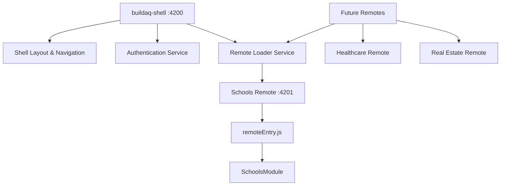

# BuildAQ Module Federation Implementation - Repository Overview

## 🎯 Status: ✅ WORKING IMPLEMENTATION

This document provides an overview of the complete Module Federation implementation for BuildAQ platform.

## Repository Structure

### 1. [buildaq.com](https://github.com/santhoshkumarvaranasi/buildaq.com) (Main)
- **Purpose**: Documentation, architecture guides, and main website
- **Contains**: Architecture documents, implementation strategies, deployment guides
- **Status**: ✅ Active documentation

### 2. [buildaq-shell](https://github.com/santhoshkumarvaranasi/buildaq-shell) (Host Application)
- **Purpose**: Module Federation host application (shell)
- **Technology**: Angular 18 + Webpack Module Federation
- **Port**: 4200 (development)
- **Status**: ✅ Working - successfully compiles and runs
- **Features**:
  - Custom layout and navigation
  - Mock authentication service
  - Dynamic remote module loading
  - Error boundary handling for remote failures

### 3. [buildaq-schools](https://github.com/santhoshkumarvaranasi/buildaq-schools) (Remote Module)
- **Purpose**: Schools domain remote micro-frontend
- **Technology**: Angular 18 + Module Federation Remote
- **Port**: 4201 (development)
- **Exposed Module**: `./SchoolsModule`
- **Status**: ✅ Working - successfully integrated with shell
- **Features**:
  - Schools dashboard and management
  - Proper NgModule structure for remote loading
  - remoteEntry.js serving correctly

## Integration Architecture



## Current Working Configuration

### Shell Application (Host)
```javascript
// webpack.config.js
module.exports = withModuleFederation({
  remotes: {
    schools: "http://localhost:4201/remoteEntry.js",
  },
});
```

### Schools Remote
```javascript
// webpack.config.js
module.exports = withModuleFederation({
  name: "schools",
  filename: "remoteEntry.js",
  exposes: {
    './SchoolsModule': './src/app/schools/schools-module.ts',
  },
});
```

### Routing Integration
```typescript
// Shell app.routes.ts
{
  path: 'schools',
  loadChildren: () => loadRemoteModule({
    type: 'module',
    remoteEntry: 'http://localhost:4201/remoteEntry.js',
    exposedModule: './SchoolsModule'
  }).then(m => m.SchoolsModule)
}
```

## Development Workflow

### Local Development
1. **Start Schools Remote**: 
   ```bash
   cd buildaq-schools
   npm start  # Port 4201
   ```

2. **Start Shell Application**:
   ```bash
   cd buildaq-shell
   npm start  # Port 4200
   ```

3. **Test Integration**: Navigate to http://localhost:4200 and click "Schools" in navigation

### Deployment Strategy

Each repository deploys independently:

- **Shell**: Azure Static Web Apps / CDN
- **Schools Remote**: Azure Static Web Apps / CDN (serves remoteEntry.js)
- **Future Remotes**: Independent deployments

Production URLs would be:
- Shell: `https://app.buildaq.com`
- Schools: `https://schools.buildaq.com/remoteEntry.js`

## Key Implementation Decisions

### ✅ Resolved Issues

1. **Angular 18 Standalone Components**: Used `--standalone=false` flag for component generation
2. **Compilation Errors**: Removed unnecessary server-side files and Nebular dependencies
3. **Module Federation Setup**: Proper webpack configuration for both host and remote
4. **Routing Integration**: Dynamic module loading with error handling

### 🎯 Next Steps

1. **Authentication Integration**: Implement Azure AD B2C across shell and remotes
2. **Additional Remotes**: Healthcare and Real Estate domains
3. **CI/CD Pipeline**: GitHub Actions for independent deployments
4. **Production Deployment**: Azure Static Web Apps with CDN distribution

## Testing the Implementation

### Prerequisites
- Node.js 18+
- Angular CLI 18+

### Quick Start
```bash
# Terminal 1 - Schools Remote
git clone https://github.com/santhoshkumarvaranasi/buildaq-schools.git
cd buildaq-schools
npm install && npm start

# Terminal 2 - Shell Application  
git clone https://github.com/santhoshkumarvaranasi/buildaq-shell.git
cd buildaq-shell
npm install && npm start

# Open browser: http://localhost:4200
# Click "Schools" to see Module Federation in action
```

## Documentation

- [Micro-Frontend Architecture](./buildaq-micro-frontend-architecture.md)
- [Module Federation Implementation](./shell-module-federation-implementation.md)  
- [Deployment Strategy](./micro-frontend-deployment-strategy.md)
- [Implementation Roadmap](./buildaq-implementation-roadmap.md)

## Repository Links

- 🏠 [Main Documentation](https://github.com/santhoshkumarvaranasi/buildaq.com)
- 🏗️ [Shell Application](https://github.com/santhoshkumarvaranasi/buildaq-shell)
- 🏫 [Schools Remote](https://github.com/santhoshkumarvaranasi/buildaq-schools)

---

**Last Updated**: November 17, 2025  
**Status**: Working implementation ready for production deployment